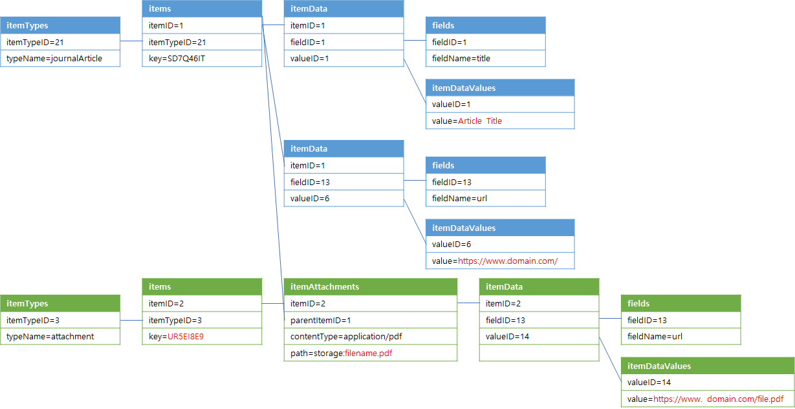

# Download Missing Zotero Attachment File

This python script helps you download missing attachment files in Zotero.

## Run the script

```bash
python3 dmz.py c:\zotero
```

## Notes

- The script will receive a command line argument for the path to your Zotero database file.
- This script accesses your Zotero SQLite database to identify missing attachments and downloads them.
- Ensure that your Zotero database is not open in Zotero during script execution.
- The downloaded files will be saved in the zotero storage directory.
- Use it responsibly and respect copyright and licensing agreements when downloading files.

## Zotero SQLite Database Table Reference

### Table Structure with Example used in the Script



### Table Schema

#### `itemTypes` Table

```sql
CREATE TABLE itemTypes (
    itemTypeID         INTEGER PRIMARY KEY,
    typeName           TEXT,
    templateItemTypeID INT,
    display            INT     DEFAULT 1
);
```

#### `items` Table

```sql
CREATE TABLE items (
    itemID             INTEGER   PRIMARY KEY,
    itemTypeID         INT       NOT NULL,
    dateAdded          TIMESTAMP NOT NULL DEFAULT CURRENT_TIMESTAMP,
    dateModified       TIMESTAMP NOT NULL DEFAULT CURRENT_TIMESTAMP,
    clientDateModified TIMESTAMP NOT NULL DEFAULT CURRENT_TIMESTAMP,
    libraryID          INT       NOT NULL,
    [key]              TEXT      NOT NULL,
    version            INT       NOT NULL DEFAULT 0,
    synced             INT       NOT NULL DEFAULT 0,
    UNIQUE (libraryID, [key]),
    FOREIGN KEY (libraryID)
    REFERENCES libraries (libraryID) ON DELETE CASCADE
);
```

#### `itemData` Table

```sql
CREATE TABLE itemData (
    itemID  INT,
    fieldID INT,
    valueID,
    PRIMARY KEY (itemID, fieldID),
    FOREIGN KEY (itemID) REFERENCES items (itemID) ON DELETE CASCADE,
    FOREIGN KEY (fieldID) REFERENCES fieldsCombined (fieldID),
    FOREIGN KEY (valueID) REFERENCES itemDataValues (valueID)
);
```

#### `itemDataValues` Table

```sql
CREATE TABLE itemDataValues (
    valueID INTEGER PRIMARY KEY,
    value           UNIQUE
);
```

#### `itemAttachments` Table

```sql
CREATE TABLE itemAttachments (
    itemID                        INTEGER PRIMARY KEY,
    parentItemID                  INT,
    linkMode                      INT,
    contentType                   TEXT,
    charsetID                     INT,
    path                          TEXT,
    syncState                     INT     DEFAULT 0,
    storageModTime                INT,
    storageHash                   TEXT,
    lastProcessedModificationTime INT,
    FOREIGN KEY (itemID) REFERENCES items (itemID) ON DELETE CASCADE,
    FOREIGN KEY (parentItemID) REFERENCES items (itemID) ON DELETE CASCADE,
    FOREIGN KEY (charsetID) REFERENCES charsets (charsetID) ON DELETE SET NULL
);
```

#### `fields` Table

```sql
CREATE TABLE fields (
    fieldID       INTEGER PRIMARY KEY,
    fieldName     TEXT,
    fieldFormatID INT,
    FOREIGN KEY (fieldFormatID)
    REFERENCES fieldFormats (fieldFormatID)
);
```
